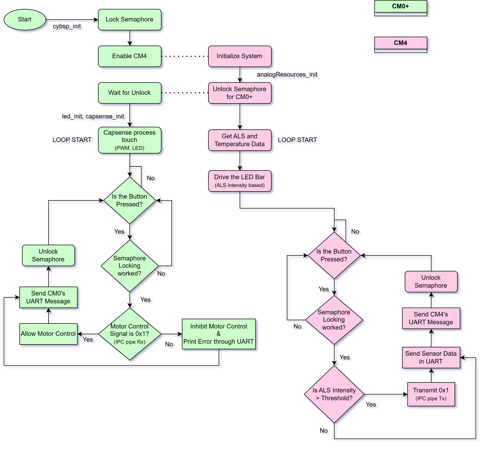
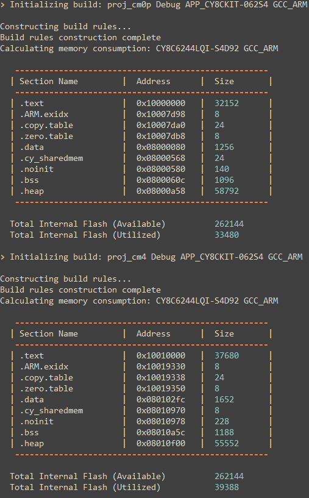

# AtTheCore_DesignChallenge_PSoC62S4
 This repo includes the project files implemented on PSoC62S4 pioneer kit for the Infineon AtTheCore design challenge at element14. This involves using capsense, led bar, ambient light and temperature sensor for doing motor control operation by the PWM generated through PSoC 6 peripheral

## Blogs Posted @ Element14 Community
[AtTheCore: Blog #1 - Intro and what's up with the kit!](https://community.element14.com/challenges-projects/design-challenges/at-the-core-design-challenge/b/blog/posts/atthecore_5f00_blog1_5f00_navadeep)  

[AtTheCore: Blog #2 - Interfacing LED Bar with ALS](https://community.element14.com/challenges-projects/design-challenges/at-the-core-design-challenge/b/blog/posts/atthecore-blog-2---interfacing-led-bar-with-als)  

[AtTheCore: Blog #3 - PWM and Capsense on Cortex M0+](https://community.element14.com/challenges-projects/design-challenges/at-the-core-design-challenge/b/blog/posts/atthecore-blog-3---pwm-and-capsense-on-cortex-m0)  

[AtTheCore: Blog #3 - PWM and Capsense on Cortex M0+](https://community.element14.com/challenges-projects/design-challenges/at-the-core-design-challenge/b/blog/posts/atthecore-blog-4---adding-shared-pwm-testing-with-scope-and-all-about-dual-core)  

[AtTheCore: Blog #5 - Brining altogether, Multi-Core deployment and Application](https://community.element14.com/challenges-projects/design-challenges/at-the-core-design-challenge/b/blog/posts/atthecore-blog-5---brining-altogether-tmulti-core-deployment-and-application)  

## Flowchart

## Core Tasks
#### CM0+
- [x] Capsense Touch and Slider
- [x] 2 x PWM generation - shared pins
- [x] UART Transmit - core's message
- [x] Receive IPC Pipe Message - motor control command

#### CM4
- [x] Ambient Light Sensor(ALS) and Temperature Sensor
- [x] LED Bar Interface - sensor data indication
- [x] UART Transmit - core's message
- [x] Transmit IPC Pipe Message - motor control command

## Build Logs:
  

